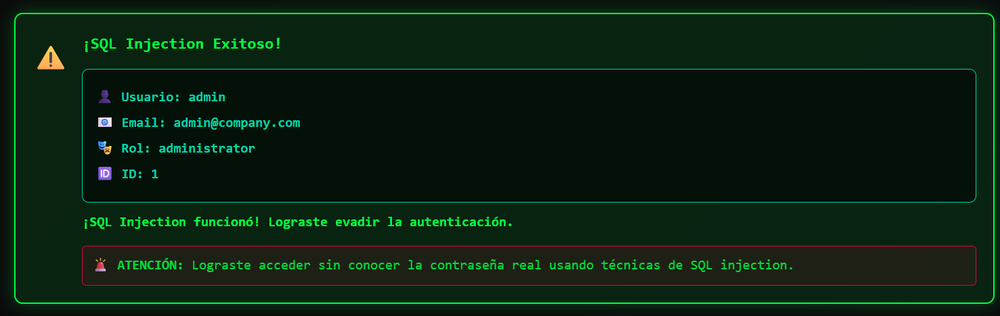
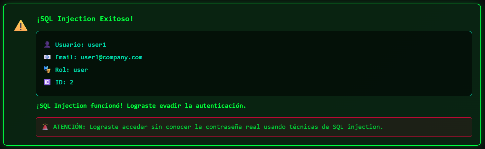
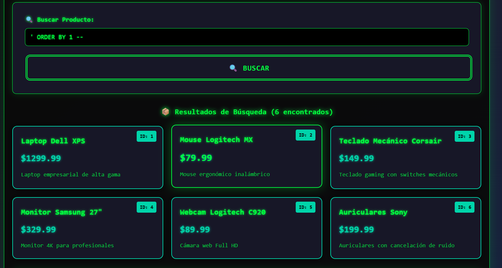
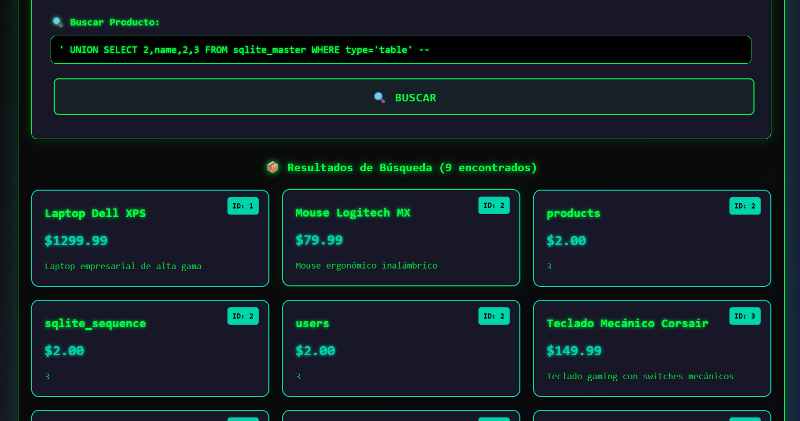
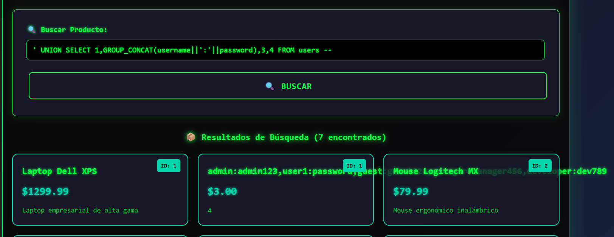
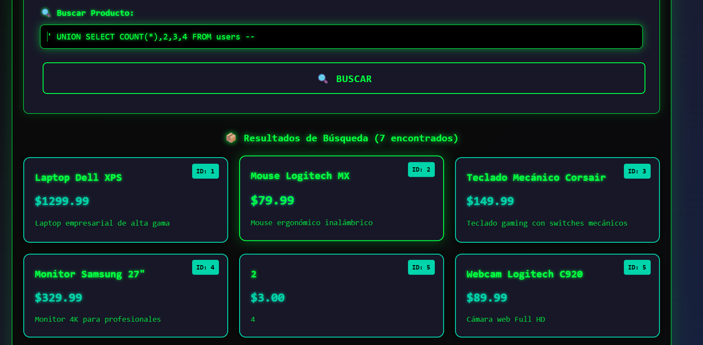
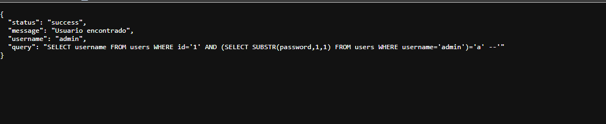
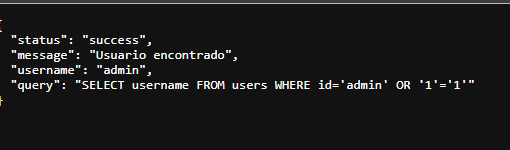
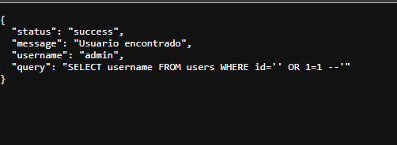
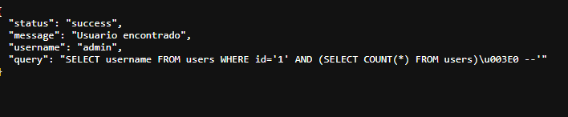

# Laboratorio SQL Injection - Análisis de Vulnerabilidades
## Información del Equipo
- **Integrante 1:** Keiner Astos - KeinerAstos
- **Integrante 2:** Sebastian Gil - [Usuario GitHub]
- **Fecha:** 25/9/2025
## 1. Instalación y Configuración
[Instrucciones actualizadas para instalar el laboratorio]
## 2. Vulnerabilidades Identificadas
### 2.1 Login Bypass
**Payload utilizado:**
#### 1. Basico 
##### Usuario
```sql
admin ' -- #usuario
```
##### Contraseña - password
```sql
keiner123 ' -- #contraseña
```


al momento de realizar la inyeccion en usuario lo que esta haciendo el codigo es comentar lo que sigue a continuacion dentro de la consulta sql, elminando la contraseña como condición para acceder

#### 2. Basico
##### Usuario
```sql
user1' OR '1'='1
```
##### Contraseña - password
```sql
sebastian ' -- #contraseña
```

dentro de esta consulta lo que estamos haciendo es volver verdadera la condicion de sql comparando 1 = 1 con un or donde si el usuario existe ya va a dar verdadera la condición sin ningun problema para acceder

#### 3. Basico
##### Usuario
```sql
' OR 1=1 --
```
##### Contraseña - password
```sql
cualquiera ' -- #contraseña
```

retorna el primer usuario registrado en la base de datos, en este caso es admin y comenta lo que va despues del usuario con el fin de dar un true en el inicio de sesion y entrando con exito al perfil admin

#### 4. Otras pruebas
##### Usuario
```sql
admin'/*
```
##### Contraseña - password
```sql
*/OR/* -- #contraseña
```
lo que hace es comentar el bloque de sql haciendo un true en la validacion con la contraseña, donde se pone cualquiera de los usuarios que estan dentro de la base de datos

### 2.2 Union-Based Injection

#### 1. Detectar numero de columnas
##### Buscar producto
```sql
' ORDER BY 1 --
```
Nos muestra el numro de colmunas que tiene la tabla en el formato de busqueda, por lo que podemos inferir que tienen 6 colmunas la tabla ya que eso es lo que nos muestra la hacer la consulta.


#### 2. Mostrar estructura de la tabla users
Cuando realizamos la siguinete consulta dentro del input nos deberia de mostrar la estructura de la tabla de users, pero nos esta devolviendo solamente el nombre de la tabla

```sql
' UNION SELECT 1,sql,2,3 FROM sqlite_master WHERE name='users' --
```

#### Consulta de datos 
Podemos identificar que al momento de poner las siguientes lineas de codigo dentro del input, nos esta devolviendo un query con toda la información de datos que se encuentran dentro de los usuarios
```sql
' UNION SELECT 1,GROUP_CONCAT(username||':'||password),3,4 FROM users --
```

esto es bastante importante a la hora de poder entrar a diferentes perfiles de los usuarios y adquirir informacion de la misma

#### Numero total de usuarios
```sql
' UNION SELECT COUNT(*),2,3,4 FROM users --
```
Ientificamos en el item 5 el resultado de la consulta


### 2.3 Blind SQL Injection
```
http://localhost:8000/user/1'%20AND%20(SELECT%20SUBSTR(password,1,1)%20FROM%20users%20WHERE%20username='admin')='a'%20--
```

Vulnerabilidad (muy breve): SQL Injection — la aplicación concatena entradas en la consulta, permitiendo inyectar subconsultas (aquí SUBSTR(password,1,1)) para extraer datos carácter por carácter.

Información que se está filtrando: ya se devuelve el username ("admin") y la inyección demuestra que se pueden obtener caracteres del campo password, por tanto el atacante puede leer la contraseña completa, enumerar tablas/columnas y acceder o modificar datos.
```
http://localhost:8000/user/admin'%20OR%20'1'='1-
```

Vulnerabilidad: La aplicación acepta y concatena entrada sin sanitizar en la consulta SQL, permitiendo SQL Injection — el atacante puede alterar la lógica de la consulta y eludir controles (por ejemplo, autenticación).

Información filtrada: La respuesta revela el username ("admin") y la propia consulta SQL, confirmando la existencia del usuario y mostrando la estructura de la consulta; con esto un atacante podría leer otros registros, enumerar tablas y potencialmente modificar o borrar datos.

```
http://localhost:8000/user/'%20OR%201=1%20--
```

Vulnerabilidad (muy breve): La entrada id se concatena directamente en la consulta y el payload '' OR 1=1 -- convierte la condición en siempre verdadera y comenta el resto, permitiendo SQL Injection y eludir la autenticación.

Información filtrada: La respuesta devuelve status, message y el username ("admin") y además muestra la consulta SQL completa, lo que revela la estructura de la consulta y facilita enumerar tablas/columnas o extraer/alterar datos adicionales.
```
http://localhost:8000/user/1'%20AND%20(SELECT%20COUNT(*)%20FROM%20users)%3E0%20--
```

ChatGPT Plus

Vulnerabilidad (muy breve): Entrada concatenada en la consulta permite SQL Injection — el atacante inyecta una subconsulta ((SELECT COUNT(*) FROM users) > 0) para manipular la lógica y extraer/confirmar datos.

Información filtrada: Devuelve el username ("admin") y la consulta SQL completa, lo que facilita confirmar la existencia de filas, enumerar tablas/columnas y seguir explotando la base de datos.
``` 

## 3. Análisis de Impacto y Contramedidas
## 🧠 Análisis de Impacto y Contramedidas

### 🔹 Ejercicio 1: Login Bypass
**Impacto:**  
Esta vulnerabilidad permite evadir los mecanismos de autenticación y acceder al sistema sin credenciales válidas. Un atacante puede iniciar sesión como cualquier usuario, incluso administrador, comprometiendo completamente la aplicación.  

**Información filtrada:**  
Credenciales de usuario, acceso no autorizado a paneles internos y potencial manipulación de datos.

**Contramedidas:**
- Implementar **consultas parametrizadas (prepared statements)**.  
- Validar y sanitizar todas las entradas de usuario.  
- No mostrar mensajes de error específicos del sistema o base de datos.  
- Implementar **bloqueo de cuenta** tras múltiples intentos fallidos.

---

### 🔹 Ejercicio 2: Union-Based Injection
**Impacto:**  
Permite a un atacante **extraer información confidencial** directamente de la base de datos combinando resultados legítimos con consultas inyectadas. Esto puede incluir usuarios, contraseñas, correos, y otros datos críticos.

**Información filtrada:**  
Tablas, nombres de columnas, y registros completos de bases de datos sensibles.

**Contramedidas:**
- Utilizar **ORMs seguros** o consultas preparadas.  
- Restringir los permisos del usuario de base de datos utilizado por la aplicación.  
- Validar los tipos de datos esperados (números, texto, etc.).  
- Implementar un **firewall de aplicaciones web (WAF)**.

---

### 🔹 Ejercicio 3: Blind Injection
**Impacto:**  
Permite inferir información de la base de datos **sin recibir mensajes directos del servidor**, utilizando respuestas condicionales (verdadero/falso o tiempos de respuesta). Aunque más lenta, esta técnica puede revelar datos críticos de forma sigilosa.

**Información filtrada:**  
Estructura de tablas, valores de campos sensibles (como contraseñas o tokens), y metadatos de la base de datos.

**Contramedidas:**
- Usar **consultas parametrizadas** para todas las operaciones SQL.  
- Implementar **límites de tiempo y detección de patrones anómalos** en las consultas.  
- Ocultar detalles del sistema en los mensajes de error y respuestas del servidor.  
- Aplicar **validación estricta del lado del servidor**.

---
## 5. Reflexión Ética del Equipo
## 🤝 Reflexión Ética del Equipo

El equipo reconoce que las vulnerabilidades exploradas durante las prácticas, como la **inyección SQL**, tienen un gran impacto en la seguridad de los sistemas de información. Aunque estas técnicas pueden ser utilizadas con fines maliciosos, nuestro objetivo académico es **comprender su funcionamiento para prevenirlas y fortalecer la seguridad** en los entornos reales.

Realizar pruebas de seguridad de forma responsable implica:
- Actuar **solo en sistemas propios o con autorización explícita**.  
- No divulgar información sensible obtenida durante pruebas.  
- Aplicar los conocimientos adquiridos para **mejorar la protección de los datos** y no para explotarlos.  
- Promover una **cultura ética y profesional** en el desarrollo de software seguro.  

En conclusión, **la seguridad informática es tanto una cuestión técnica como moral**. Comprender cómo ocurren los ataques nos convierte en mejores profesionales, responsables del diseño de sistemas más seguros y confiables.
